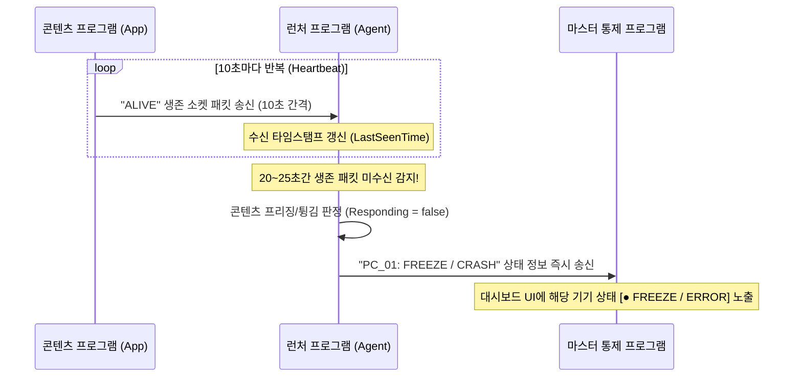

# 02. 장비 관리 및 모니터링 기능 기획 (개정 4본)

본 문서는 중앙 통제 프로그램이 제어 대상 기기들의 정보를 등록, 삭제, 관리하고 이들의 네트워크 연결 상태를 모니터링하는 방법에 대한 기획입니다. 단일 공간(`Space`) 분류, 장치 연동, 부팅 순위와 더불어 콘텐츠의 프리징(먹통) 상태를 감지하기 위한 **10초 주기 하트비트 생존 신호 검사 기획**이 추가되었습니다.

---

## 1. 장비 데이터 관리 및 설정 파일 구조

기기 정보의 안정적인 유지와 관리를 위해 텍스트 기반의 `devices.json` 파일을 사용하여 저장소 설정을 구성합니다.

### 1.1 JSON 설정 스키마 (`devices.json`)
하트비트 타임아웃 임계값 및 WOL 재시도 주기를 설정 파일 상단 메타데이터에 등록하여 유연하게 대처할 수 있도록 합니다.

```json
{
  "Devices": [
    {
      "Id": "PC_01",
      "Name": "로비 미디어월 PC",
      "Type": "PC",
      "IpAddress": "192.168.0.101",
      "MacAddress": "70-85-C2-3B-A4-9E",
      "Port": 9999,
      "Space": "로비",
      "AssociatedDeviceId": "Proj_Lobby",
      "BootOrder": 2,
      "BootDelaySeconds": 0,
      "Description": "프로젝터 예열 대기 후 2순위로 켜지는 콘텐츠 PC"
    },
    {
      "Id": "Proj_Lobby",
      "Name": "로비 빔 프로젝터",
      "Type": "Projector",
      "IpAddress": "192.168.0.201",
      "MacAddress": "",
      "Port": 4352,
      "Space": "로비",
      "AssociatedDeviceId": "",
      "BootOrder": 1,
      "BootDelaySeconds": 10,
      "Description": "로비 투사용 예열 프로젝터"
    }
  ],
  "MonitoringSettings": {
    "IntervalSeconds": 5,
    "PingTimeoutMs": 1000,
    "HeartbeatIntervalSeconds": 10,
    "HeartbeatTimeoutSeconds": 25,
    "WolRetryIntervalMinutes": 3
  }
}
```

### 1.2 모니터링 세부 설정 정의
* **HeartbeatIntervalSeconds (10초)**: 콘텐츠 프로그램이 로컬 런처 에이전트로 "나 생존해 있음" 신호를 전송하는 간격입니다.
* **HeartbeatTimeoutSeconds (25초)**: 런처 에이전트 기준, 콘텐츠로부터 생존 신호 수신이 끊겼을 때 프리징(작동 중지) 상태로 최종 낙인찍는 대기 시간입니다. (네트워크 딜레이를 고려하여 2회 전송 유실 시점인 25초 내외로 보장)
* **WolRetryIntervalMinutes (3분)**: WOL 명령을 내렸음에도 부팅되지 않는 PC들에 대해 재기동 패킷을 다시 날리는 주기(3~4분) 설정입니다.

---

## 2. 네트워크 상태 및 콘텐츠 프리징 모니터링 기능

### 2.1 10초 주기 하트비트 생존 신호 검사 프로세스

콘텐츠 프로그램(예: Unity 기반 3D 프로그램)과 로컬 런처 에이전트 간의 10초 주기 생존 검사 흐름입니다.



1. **로컬 전송 (10초 간격)**: 
   * 가동 중인 시연 콘텐츠(App)는 내부 백그라운드 타이머를 통해 로컬 루프백(`127.0.0.1:9999`)으로 10초에 한 번씩 단순 생존 플래그(예: `"HEARTBEAT"`)를 전송합니다.
2. **에이전트 검사**:
   * 각 PC에 설치된 런처 에이전트는 마지막 하트비트 수신 시간(`LastSeenTime`)을 기록합니다.
   * 백그라운드 감시 루프에서 현재 시간과 `LastSeenTime`의 차이가 **25초**를 초과하면, 해당 프로그램이 완전히 다운되었거나 화면이 멈춘 프리징 상태로 규정합니다.
3. **마스터 통보 및 상태 표기**:
   * 프리징이 판정되면 런처 에이전트는 즉시 중앙 마스터 프로그램으로 소켓 통신을 열어 경고 패킷을 날립니다.
   * 마스터 프로그램은 대시보드 기기 상태를 붉은색 깜빡임 인디케이터인 **`● FREEZE / ERROR`** 상태로 긴급 전환하여 관리자에게 알립니다.
   * 관리자는 이를 보고 마스터 UI에서 해당 기기를 선택해 원격 강제 프로세스 재기동 버튼을 클릭할 수 있습니다.
