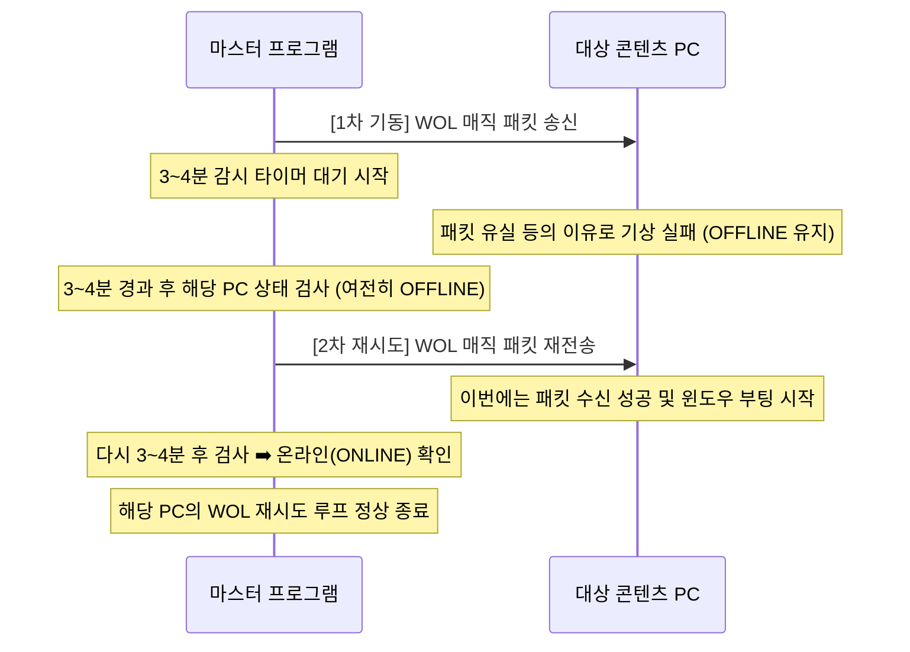

# 03. 원격 전원 켜기(Power On) 제어 기능 기획 (개정 4본)

본 문서는 꺼져 있는 PC 및 프로젝터 등의 기기를 중앙 통제 프로그램에서 원격으로 켜는 기능에 대한 세부 구현 기획입니다. 부팅 우선순위 및 딜레이 기능과 더불어, 전원 기동 명령 발송 후 정상 구동되지 않는 PC를 타겟으로 3~4분 간격으로 작동하는 **WOL 자동 재시도(WOL Auto-Retry)** 루틴이 추가되었습니다.

---

## 1. PC 전원 기동: WOL (Wake-on-LAN)

### 1.1 동작 매커니즘
PC가 꺼진 상태(대기 상태)에서 랜카드는 매직 패킷(Magic Packet)의 수신을 기다립니다. 중앙 프로그램은 대상 기기의 MAC 주소를 포장하여 로컬 네트워크 전체(Subnet Broadcast)에 패킷을 송신합니다.

### 1.2 매직 패킷 데이터 포맷
* **Header**: `0xFF` 6바이트
* **Payload**: 대상 PC의 MAC Address(6바이트) * 16번 연속 배치
* **총 크기**: 102 Bytes
* **전송 프로토콜**: **UDP** 브로드캐스트 (`255.255.255.255`)
* **기본 포트**: `9` (또는 `7`)

### 1.3 C# 구현 로직 설계
```csharp
public static void SendWakeOnLan(string macAddress)
{
    byte[] macBytes = ParseMacAddress(macAddress);
    
    byte[] packet = new byte[102];
    for (int i = 0; i < 6; i++) packet[i] = 0xFF;
    for (int i = 1; i <= 16; i++)
    {
        Buffer.BlockCopy(macBytes, 0, packet, i * 6, 6);
    }

    using (UdpClient client = new UdpClient())
    {
        client.Connect(IPAddress.Broadcast, 9);
        client.Send(packet, packet.Length);
    }
}
```

---

## 2. 프로젝터 전원 기동: PJLink ON

### 2.1 동작 매커니즘
프로젝터가 대기 모드(Standby)인 경우 LAN 카드와 내장 프로세서는 TCP 포트를 열고 연결을 대기합니다. 중앙 프로그램은 프로젝터 IP의 **TCP 포트 4352**로 소켓을 연결하고 표준 켜기 커맨드를 전송합니다.

### 2.2 명령어 규격 (PJLink Class 1)
* **연결 확인**: TCP 연결 성공 시 기기에서 `PJLINK 0\r` 또는 `PJLINK 1 <임의값>\r` 수신.
* **전송 명령어**: `%1POWR 1\r` (전원 켜기)
* **응답 결과**: `%1POWR=OK\r`

---

## 3. 부팅 우선순위 및 딜레이 시퀀서

일괄 또는 공간 단위 기동 시, 기기별로 지정된 `BootOrder`와 `BootDelaySeconds` 속성을 분석하여 가동 순서를 비동기적으로 스케줄링합니다. (세부 로직 및 C# Sequence Dispatcher는 이전 기획 문서 기준 유지)

---

## 4. 미기동 PC 자동 재시도 기획: WOL Auto-Retry Loop

WOL 신호를 쏘아 보냈음에도 네트워크 혼잡이나 패킷 유실, 일시적인 하드웨어 지연으로 인해 켜지지 않고 계속 `OFFLINE` 상태로 방치되어 있는 PC들을 구제하기 위한 백그라운드 재시도 자동 루틴입니다.

### 4.1 동작 시퀀스 다이어그램



### 4.2 세부 작동 매커니즘
1. **재시도 대상 등록**:
   * 마스터 프로그램에서 [전체 켜기] 또는 [구역 켜기] 명령을 수행하면, 켜기 명령이 들어간 PC들의 ID 목록과 최초 기동 시각을 **"재기동 추적 리스트(WOL Tracker)"**에 등록합니다.
2. **주기적 미구동 기기 스캔 (3~4분 간격)**:
   * 백그라운드 스레드가 설정된 재기동 주기(예: `3분`)마다 WOL Tracker에 등록된 PC들의 현재 모니터링 상태를 검사합니다.
   * 이미 부팅이 완료되어 **`ONLINE` 상태인 PC는 Tracker 리스트에서 제거**합니다.
   * 여전히 **`OFFLINE` 상태를 유지하고 있는 PC**에 한해서만, 해당 PC의 MAC 주소로 **WOL 매직 패킷을 즉시 다시 한 번 재발송**합니다.
3. **최대 시도 횟수 제한 (Max Attempts)**:
   * 무한정 패킷을 발송하는 낭비를 차단하기 위해, 재기동 시도는 **최대 3회**로 제한합니다. 3회 재시도(최대 약 10~12분 소요) 후에도 켜지지 않는 장비는 물리적 전원 차단이나 메인보드 고장 등의 하드웨어 장애로 최종 판정하고 **`● CRITICAL / OFFLINE`** 경고 표시와 함께 추적을 중단합니다.
