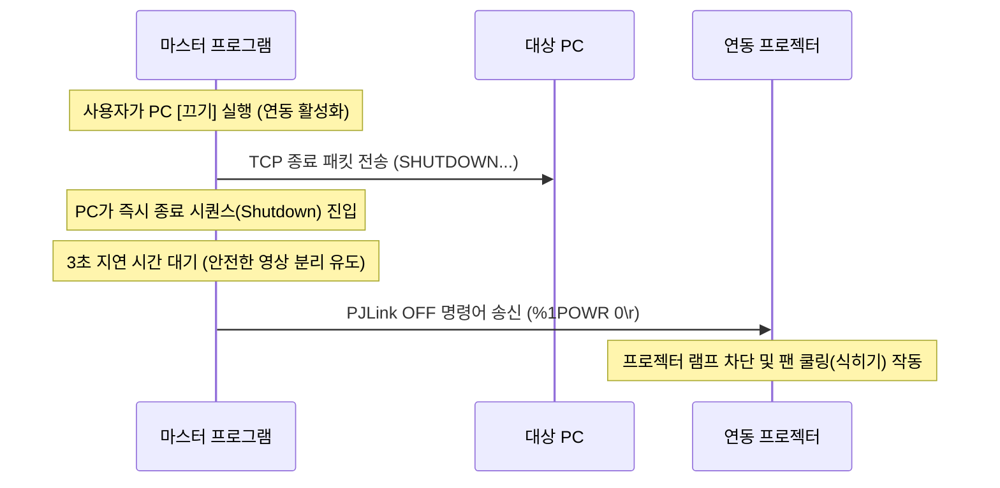

# 04. 원격 전원 끄기(Power Off) 제어 기능 기획 (개정 2본)

본 문서는 운영 중인 PC 및 빔 프로젝터 등을 중앙 통제 프로그램에서 안전하고 원격으로 종료시키는 기능에 대한 세부 구현 기획입니다. 전체/공간별 종료 방식뿐만 아니라, 특정 기기를 종료할 때 연동된 화면 출력 기기(빔 프로젝터 등)를 순차적으로 동시 종료하는 **세트/연동 종료** 제어가 추가되었습니다.

---

## 1. PC 전원 종료: TCP Agent 기반 강제 종료

### 1.1 동작 매커니즘
PC는 이미 구동 중인 상태이므로 운영체제 내부적으로 종료 신호를 처리해야 합니다. 중앙 프로그램은 대상 PC의 IP와 약속된 포트(**TCP 9999**)로 통신을 연결한 뒤, 종료 패킷을 전송하여 수신 대기 중인 런처 프로그램(Agent)이 강제 셧다운 명령을 실행하도록 합니다.

### 1.2 명령어 규격
* **종료 명령어**: `SHUTDOWN:<SECRET_KEY>\r\n`
* **C# 송신 로직 설계**:
  ```csharp
  public static void SendPcShutdown(string ipAddress, int port, string secretKey)
  {
      using (TcpClient client = new TcpClient())
      {
          var result = client.BeginConnect(ipAddress, port, null, null);
          var success = result.AsyncWaitHandle.WaitOne(TimeSpan.FromSeconds(3));
          
          if (!success) throw new TimeoutException("에이전트 연결에 실패했습니다.");
          
          client.EndConnect(result);
          
          using (NetworkStream stream = client.GetStream())
          {
              string command = $"SHUTDOWN:{secretKey}\r\n";
              byte[] data = Encoding.UTF8.GetBytes(command);
              stream.Write(data, 0, data.Length);
          }
      }
  }
  ```

---

## 2. 프로젝터 전원 종료: PJLink OFF

### 2.1 동작 매커니즘
프로젝터의 전원을 원격으로 끕니다. 프로젝터는 전원 OFF 명령을 받으면 즉시 램프를 끄고 내장 팬을 고속으로 돌려 기기 열을 식히는 **쿨링(Cooling) 단계**를 시작합니다.

### 2.2 명령어 규격
* **연결**: **TCP Port 4352**로 소켓 연결
* **종료 명령어**: `%1POWR 0\r`
* **응답 결과**: `%1POWR=OK\r`

---

## 3. 세트(Set) 및 단독 전원 끄기 흐름 제어

기기의 소속 상태 및 관계 설정 여부에 따른 끄기 처리 흐름입니다.

### 3.1 단독 끄기 (Individual Control)
* 화면 대시보드 상에서 PC 혹은 프로젝터 단독으로 `[끄기]` 버튼을 눌러 개별 기기만 종료하는 모드입니다.
* 예: 다른 세트는 켜둔 채로 특정 프로젝터만 잠시 끄거나, 일반 모니터를 사용하는 독립 PC만 끄고 싶을 때 수행합니다.

### 3.2 세트/연동 끄기 (Linked Control)
* PC 종료 시 그 PC에 연결된 빔 프로젝터 등의 화면 기기를 한 세트로 묶어서 순차적으로 안전하게 끄는 모드입니다.



1. 사용자가 PC의 `[끄기]` 명령을 실행합니다.
2. 마스터 프로그램은 해당 PC로 `TCP 종료 패킷`을 발송해 윈도우 OS를 정상 셧다운시킵니다.
3. 동시에 해당 PC의 `AssociatedDeviceId`를 파악하여 연동 장치가 있는지 점검합니다.
4. 연동된 프로젝터 장치 정보가 존재할 경우, PC 종료 신호 송신 후 **3초 동안 대기**합니다.
   * 이는 PC 비디오 출력이 종료되는 것과 기기 차단 시간 사이의 완충 작용을 하며 기기 통신 오작동을 예방하기 위함입니다.
5. 3초 대기 후 연동 프로젝터의 IP/Port(TCP 4352)로 `PJLink OFF` 명령어를 송신합니다.
6. 프로젝터는 쿨링 단계에 진입하며, 마스터 프로그램은 해당 프로젝터의 쿨링 종료 여부를 실시간으로 추적하여 대시보드에 표시합니다.
