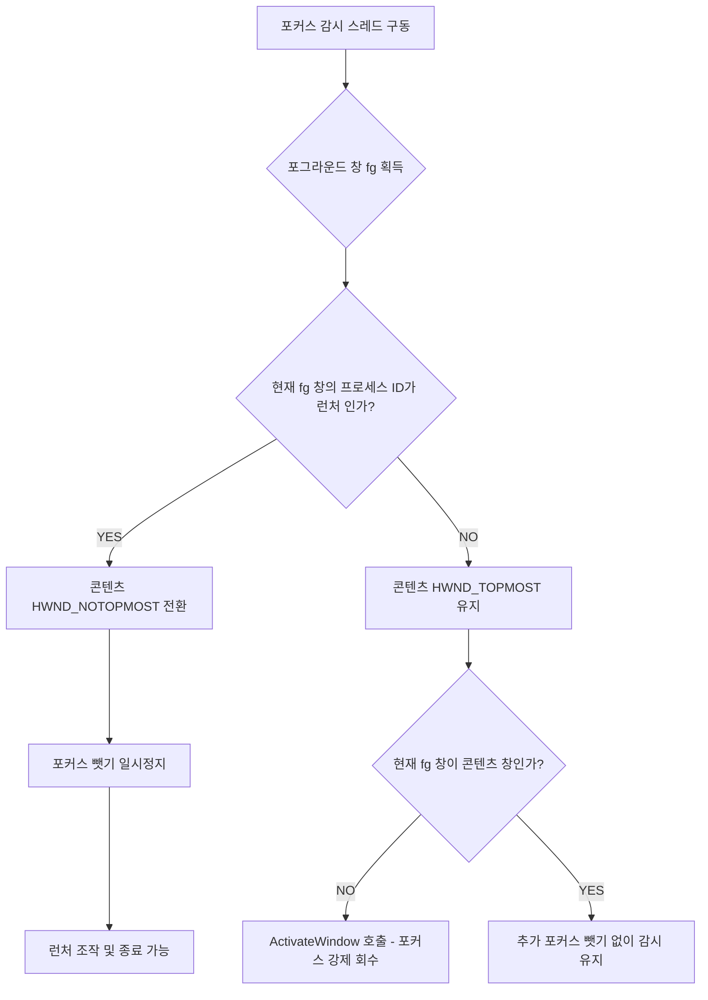

# [Part 2] 지능형 포커스 제어 및 프로세스 생사 감시 체계

시연용 콘텐츠의 지연 기동(선행 구동 모듈 탑재) 체계와 다중 프로세스 동작 환경에서의 동적 화면 포커스 유지 및 이중 진단 감시 기술 분석서입니다.

---

## ⚙️ 1. 선행구동모듈 및 메인 빌드 지연(Delay) 구동 흐름
메인 그래픽 시연 프로그램이 켜지기 전에 센서 제어용 백그라운드 프로그램이나 트래커 제어 래퍼 등이 반드시 먼저 기동되어 있어야 하는 쇼룸용 특수 환경을 완벽하게 충족합니다.

1. **선행 모듈 기동**: 선행 구동 모듈 경로가 지정되어 있는 경우, 런처는 해당 모듈을 `Process.Start`로 가장 먼저 기동시킵니다.
2. **지연 타이머 개시**: 모듈이 켜진 후 메인 콘텐츠가 켜지기 전까지 대기 시간을 부여합니다. 
3. **대기 시간 10초 방어 밸리데이션 검사**:
   * 사용자의 부주의로 대기 시간이 너무 짧게(예: 1~2초) 설정되어 백그라운드 장비가 준비되기 전에 게임이 켜져 연동 오류가 발생하는 문제를 차단합니다.
   * `EditForm`에서 저장을 시도할 때 대기 시간 값이 **10초 미만**인 경우, 경고 메시지를 표시하고 저장을 제한하는 유효성 검사 로직이 동작합니다.
4. **메인 콘텐츠 기동**: 타이머 카운트다운이 0초에 이르면 비로소 본 게임(시연 콘텐츠 .exe)이 실행되고, 런처는 화면 포커스 방해를 피하기 위해 자동으로 트레이로 강제 최소화됩니다.

---

## 🔒 2. 상호작용형 동적 포커스(Topmost) 복원 시스템
포커스 유지(`keepFocus`) 기능이 켜져 있는 콘텐츠의 강제 포커싱 억제력과 관리자의 런처 조작성을 정밀하게 타협시킨 최신 상호작용형 모니터링 스레드(`StartFocusMonitorThread`)가 탑재되어 있습니다.

### 런처 활성화 감지 및 Topmost 일시 해제
* 모니터링 스레드는 1초 주기로 현재 활성화된 윈도우 창(`GetForegroundWindow`)의 스레드 프로세스 ID를 윈32 API(`GetWindowThreadProcessId`)로 추출합니다.
* 활성화된 창이 런처 창 또는 그 자식 폼일 때: 콘텐츠 창의 `HWND_TOPMOST` 속성을 일시 해제(`HWND_NOTOPMOST`로 변경)하고 포커스를 강제로 가져가지 않습니다. 이 덕분에 관리자는 콘텐츠 포커스 고정이 켜져 있더라도 런처를 클릭하여 자유롭게 세팅하고 런처 창에서 콘텐츠를 안전하게 강제 종료할 수 있습니다.

### 타 창 활성화 시 Topmost 및 포커스 고정 복원
* 활성화된 창이 런처가 아닐 때(예: 사용자가 다른 일반 프로그램 창을 누르거나 조작하려 할 때): 시연 화면이 가려지지 않도록 콘텐츠 창에 즉시 `HWND_TOPMOST` 속성을 강제 재부여하여 화면 맨 위로 강제 인양합니다.
* 활성화된 창이 콘텐츠 본인 창도 아닐 때: `ActivateWindow`를 유도해 포커스를 콘텐츠 창으로 즉각 회수하여 관람객의 바탕화면 노출이나 시스템 임의 조작을 원천 방어합니다.

### 기동 모드별 포커스 조작 분기
* **단일 exe 빌드 (포커스 유지 ON)**: 타겟 윈도우 핸들이 살아있는 동안 주기적으로 최상단 포커스를 위 시스템을 통해 상시 강제 유지합니다.
* **래퍼/컨테이너 빌드 (포커스 유지 OFF)**: 콘텐츠 실행 초기 1회만 포커스를 정상적으로 밀어주고, 이후 주 주기 강제 회수는 일체 수행하지 않습니다.

---

## 🔎 3. 이중 예외처리 생사 감시(Watchdog) 알고리즘
프로세스가 종료되었는지를 매 초 판단하여 런처 카드 UI에 실행 정보를 100% 정밀하게 반영하는 이중 안전 진단 알고리즘입니다.

### 1차 진단 (`Process.HasExited` 검사 및 권한 예외 방어)
* 백그라운드 타이머(`CheckProcessStatuses`)에서 콘텐츠 메인 핸들의 `HasExited` 속성을 읽어 기동 여부를 진단합니다.
* 만약 런처가 관리자 권한이 아닌 상황에서 다른 관리자 권한 프로세스를 모니터링할 시 발생할 수 있는 `UnauthorizedAccessException` 등의 예외 상황을 캐치하면, 일단 프로세스가 종료된 것으로 안전하게 간주(`hasExited = true`, `needsDoubleCheck = true`)하고 2차 정밀 더블 체크 필터로 이양시킵니다.

### 2차 진단 (이름 기반 프로세스 리스트 더블 체크)
* 예외가 나거나 메인 핸들이 끊겨 더블 체크(`needsDoubleCheck = true`)가 필요해진 경우에만, 시스템 전체 프로세스 리스트에서 실행 파일 이름(`GetProcessesByName`)이 존재하는지를 2차 필터링합니다. 
* 이름으로 매칭되는 프로세스가 있다면 핸들을 갱신하고 살아있는 상태(`hasExited = false`)로 안전하게 복원하며, 진짜로 없다고 최종 규명되면 그제야 감시 리스트에서 제외합니다.

### 3차 최적화 (수동 종료 즉시 해제 보장)
* 사용자가 직접 콘텐츠 X 단추나 수동 단축키로 정상 종료하여 `HasExited = true`를 정상 보고한 경우: 더블 체크 필요 여부 플래그(`needsDoubleCheck`)를 `false`로 차단하여, 덜 소멸한 좀비 프로세스 등으로 인해 종료 상태가 갱신되지 않고 "실행 중"에 락이 걸리던 문제를 차단했습니다.
* 즉각 `activeProcesses.Remove(id)`로 이양되어 1초 만에 카드 뷰가 깨끗하게 "▶️ 실행" 상태등(회색)으로 복원됩니다.
