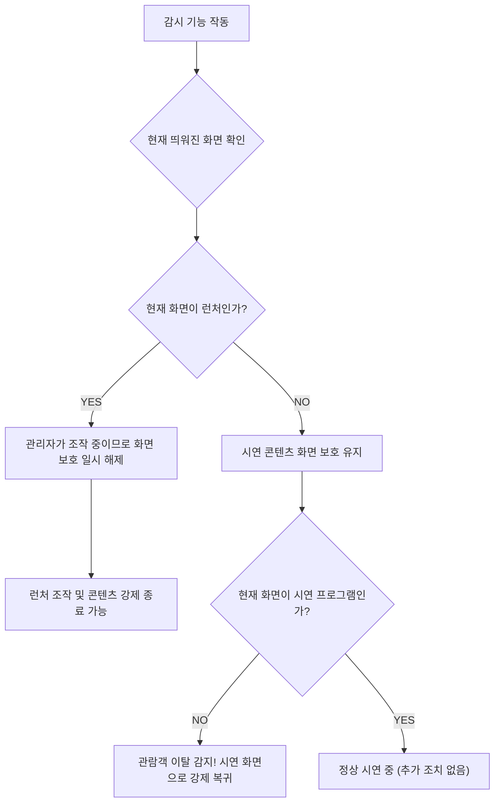

# [Part 2] 지능형 포커스 제어 및 프로세스 생사 감시 체계

시연용 콘텐츠의 지연 기동(선행 구동 모듈 탑재) 체계와 다중 프로세스 동작 환경에서의 동적 화면 포커스 유지 및 이중 진단 감시 기술 분석서입니다.

---

## ⚙️ 1. 선행구동모듈 및 메인 빌드 지연(Delay) 구동 흐름
메인 그래픽 시연 프로그램이 켜지기 전에 센서 제어용 백그라운드 프로그램이나 트래커 제어 래퍼 등이 반드시 먼저 기동되어 있어야 하는 쇼룸용 특수 환경을 완벽하게 충족합니다.

1. **선행 모듈 기동**: 선행 구동 모듈 경로가 지정되어 있는 경우, 런처는 해당 모듈을 `Process.Start`로 가장 먼저 기동시킵니다.
2. **지연 타이머 개시**: 모듈이 켜진 후 메인 콘텐츠가 켜지기 전까지 대기 시간을 부여합니다. 
3. **대기 시간 10초 방어 밸리데이션 검사**:
   * 사용자의 부주의로 대기 시간이 너무 짧게(예: 1~2초) 설정되어 백그라운드 장비가 준비되기 전에 게임이 켜져 연동 오류가 발생하는 문제를 차단합니다.
   * `EditForm`에서 저장을 시도할 때 대기 시간 값이 **10초 미만**인 경우, 경고 메시지를 표시하고 저장을 제한하는 유효성 검사 로직이 동작합니다.
4. **메인 콘텐츠 기동**: 타이머 카운트다운이 0초에 이르면 비로소 본 게임(시연 콘텐츠 .exe)이 실행되고, 런처는 화면 포커스 방해를 피하기 위해 자동으로 트레이로 강제 최소화됩니다.

---

## 🔒 2. 시연 화면 보호 및 자동 복귀 시스템
관람객이 실수로 시연 프로그램을 끄거나 바탕화면으로 나가는 것을 방지하면서도, 관리자는 언제든 런처를 조작할 수 있도록 똑똑하게 화면을 지켜주는 기능입니다.

### 관리자 조작 시 화면 보호 일시 해제
* 컴퓨터가 1초마다 현재 사용자가 어떤 화면을 보고 있는지 확인합니다.
* 관리자가 런처 화면을 열어 조작 중일 때는, 시연 콘텐츠가 화면을 강제로 뺏어가지 않도록 양보합니다. 덕분에 관리자는 런처에서 설정을 바꾸거나 프로그램을 안전하게 끌 수 있습니다.

### 관람객 이탈 방지 (타 화면 클릭 시 강제 복귀)
* 활성화된 창이 런처가 아닐 때(예: 관람객이 다른 프로그램을 누르거나 윈도우 시작 버튼을 누를 때): 과거에는 화면을 아예 맨 위에 못 박아두었으나, 현재는 자연스럽게 화면을 전환할 수 있도록 강제 고정을 풀었습니다.
* 하지만 관람객이 시연 프로그램이 아닌 바탕화면이나 엉뚱한 창을 누른 것을 감지하면, 1초 만에 즉시 시연 화면을 맨 앞으로 당겨옵니다. 이를 통해 관람객의 시스템 임의 조작을 안전하게 방어합니다.

### 기동 모드별 맞춤 동작
* **화면 보호 켜기 (단일 프로그램)**: 프로그램이 켜져 있는 내내 관람객이 다른 화면으로 빠져나가지 못하게 시연 화면을 계속 맨 앞으로 유지시켜 줍니다.
* **화면 보호 끄기 (특수 연동 프로그램)**: 실행될 때 딱 한 번만 화면을 앞으로 띄워주고, 그 뒤로는 화면을 억지로 뺏어오지 않습니다.

---

## 🔎 3. 이중 예외처리 생사 감시(Watchdog) 알고리즘
프로세스가 종료되었는지를 매 초 판단하여 런처 카드 UI에 실행 정보를 100% 정밀하게 반영하는 이중 안전 진단 알고리즘입니다.

### 1차 진단 (`Process.HasExited` 검사 및 권한 예외 방어)
* 백그라운드 타이머(`CheckProcessStatuses`)에서 콘텐츠 메인 핸들의 `HasExited` 속성을 읽어 기동 여부를 진단합니다.
* 만약 런처가 관리자 권한이 아닌 상황에서 다른 관리자 권한 프로세스를 모니터링할 시 발생할 수 있는 `UnauthorizedAccessException` 등의 예외 상황을 캐치하면, 일단 프로세스가 종료된 것으로 안전하게 간주(`hasExited = true`, `needsDoubleCheck = true`)하고 2차 정밀 더블 체크 필터로 이양시킵니다.

### 2차 진단 (이름 기반 프로세스 리스트 더블 체크)
* 예외가 나거나 메인 핸들이 끊겨 더블 체크(`needsDoubleCheck = true`)가 필요해진 경우에만, 시스템 전체 프로세스 리스트에서 실행 파일 이름(`GetProcessesByName`)이 존재하는지를 2차 필터링합니다. 
* 이름으로 매칭되는 프로세스가 있다면 핸들을 갱신하고 살아있는 상태(`hasExited = false`)로 안전하게 복원하며, 진짜로 없다고 최종 규명되면 그제야 감시 리스트에서 제외합니다.

### 3차 최적화 (빠른 상태 업데이트 및 런처 자동 팝업)
* 관리자가 X 버튼을 눌러 정상적으로 프로그램을 껐을 때: 이중 확인 과정을 건너뛰고 1초 만에 즉각 런처 화면에 "▶️ 실행 가능(회색)" 상태로 깨끗하게 복구됩니다.
* **콘텐츠 종료 시 런처 자동 팝업**: 실행 중이던 콘텐츠가 하나라도 종료되면, 트레이 아이콘에 숨어있던 런처가 자동으로 화면 중앙에 나타납니다. 관리자가 런처를 다시 찾을 필요 없이 바로 다음 조치를 취할 수 있어 매우 편리합니다.
