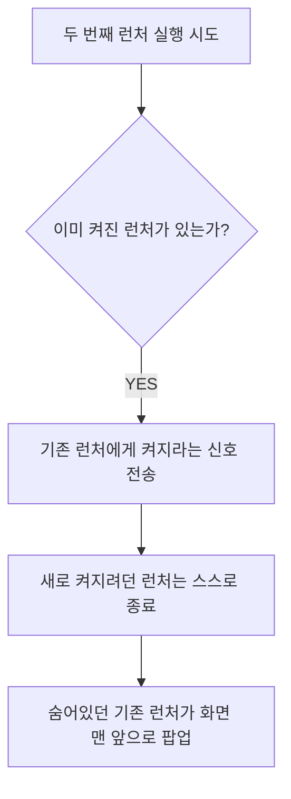

# [Part 3] 시스템 트레이, Mutex 중복 차단 및 자동 종료 스케줄러

런처의 비정상 종료를 예방하기 위한 시스템 트레이 전환 설계, 중복 실행 방지 Mutex 윈도우 메시지 복원 시스템, 스케줄러 기반의 프로세스 순차 클린업 및 시스템 종료 로직 기술 사양서입니다.

---

## 📥 1. ESC 트레이 최소화 강제 이동 구조
관리자가 런처 화면 내에서 ESC 키를 실수로 누르거나 키보드 오동작이 발생했을 때, 프로그램이 갑자기 꺼져 전체 콘텐츠 관리에 틈이 생기는 현상을 완전 차단합니다.

* **키 감지 핸들러 (`MainWindow_KeyDown`)**: 런처 창에 포커스가 유지된 상태에서 `KeyEventArgs`로 `Keys.Escape`를 검출합니다.
* **이벤트 가로채기 및 은닉**: 프로그램 종료 프로세스를 밟지 않고, `e.Handled = true`로 키 입력을 소멸시킨 뒤 즉시 `this.Hide()`를 실행하여 백그라운드 시스템 트레이 영역으로 런처 창을 안전하게 은닉(최소화) 시킵니다.

---

## 🛡️ 2. 프로그램 중복 실행 차단 및 원래 화면 찾아주기
관리자가 런처를 여러 번 더블클릭해서 프로그램이 여러 개 켜지는 꼬임 현상을 막아주는 똑똑한 기능입니다.

### 중복 실행 감지
* 런처가 켜질 때 고유한 이름표를 달고 시작합니다. 이미 똑같은 이름표가 있다면 새 런처는 "이미 켜져 있구나!" 하고 인식합니다.

### 기존 화면 팝업 복원
* 중복 실행을 인식하면 새로 켜지려던 런처는 시스템 구석에 숨어있을지 모르는 기존 런처를 찾아내 "화면으로 나와!"라는 신호를 보냅니다.
* 신호를 받은 기존 런처는 즉시 화면 중앙 맨 앞으로 당당하게 나타나고, 두 번째로 켜졌던 런처는 조용히 꺼집니다.

---

## ⏰ 3. 글로벌 자동화 스케줄러 및 전원(PC 끄기) 제어
정해진 영업 마감 시각이나 특정 타이밍에 자동으로 모든 시연을 종료하고 PC 전원까지 안전하게 셧다운시키는 스마트 셧다운 시나리오입니다.

1. **글로벌 스케줄러 틱 동기화**: `statusTimer`가 1초마다 돌며 `schedulerEnabled` 상태와 등록된 마감 시간(`autoShutdownTime`, format: `HH:mm`)이 현재 시간과 일치하는지 정밀 진단합니다.
2. **콘텐츠 순차 클린업 (`KillAllActive`)**:
   * 지정 시간에 다다르는 즉시 기동 중인 모든 콘텐츠(`activeProcesses`)의 동작 스레드를 정지하고, 메인 및 모듈 하위 프로세스 트리까지 깔끔하게 파워 종료(`Kill`)시킵니다.
3. **윈도우 shutdown 전원 제어**:
   * '종료 시 PC도 끄기' 옵션(`isPcShutdown = true`)이 체크되어 있다면, OS 명령프롬프트를 경유해 `shutdown /s /t 30` 명령을 무소음 백그라운드 모드로 발사합니다.
   * 이에 따라 윈도우 OS는 30초의 유예 시간을 두고 본체 전원을 안전하게 셧다운시킵니다.

---

## 💾 4. BaseDirectory 귀속형 `config.json` 절대 경로 고정
배포 대상 PC의 실행 환경(작업 디렉토리 꼬임)이나 압축 프로그램 구동 폴더에 관계없이 설정 데이터를 안전하게 보존하기 위한 파일 입출력 아키텍처입니다.

* **상대 경로의 위험성**: 일반적인 `"config.json"` 상대 경로는 프로그램이 기동된 윈도우 작업 디렉토리 기준이므로, 읽기 전용 구역(압축 내부 임시 Temp 폴더 등)에서 런칭할 때 쓰기 권한 부족으로 인해 `Access Denied` 에러가 나서 런처 기능이 중단되었습니다.
* **절대 경로 고정**: 설정 파일의 물리 주소를 `Path.Combine(AppDomain.CurrentDomain.BaseDirectory, "config.json")`으로 완전히 강제화했습니다. 
* 실행 파일(`Launcher.exe`)이 위치한 로컬 본인 디렉토리 영역만을 엄격하게 타겟팅하여 설정 파일을 열고 쓰므로, 배포 및 간접 호출 시 발생할 수 있는 보안 경로 충돌 문제를 영구적으로 해결했습니다.

---

## 🌐 5. 아이패드 등 외부 기기를 통한 원격 제어
외부 기기(아이패드, 중앙 컨트롤러 등)에서 통신망을 통해 런처와 컴퓨터를 원격으로 조종할 수 있는 편리한 기능입니다.

* **원격 기상 (WAKEUP)**: 원격으로 '켜기' 명령을 받으면, 구석에 숨어있던 런처가 즉시 화면 중앙으로 나타나며 자동 실행 예약이 걸려있는 콘텐츠들을 스스로 켭니다.
* **원격 끄기 (SHUTDOWN)**: '끄기' 명령을 받으면, 런처 화면 상단에 20초 카운트다운 경고창이 뜹니다. 만약 실수로 눌렀다면 '취소(대피)' 버튼을 눌러 꺼지는 것을 막을 수 있습니다. 아무 조작이 없으면 20초 뒤에 컴퓨터 전원이 자동으로 안전하게 꺼집니다.
