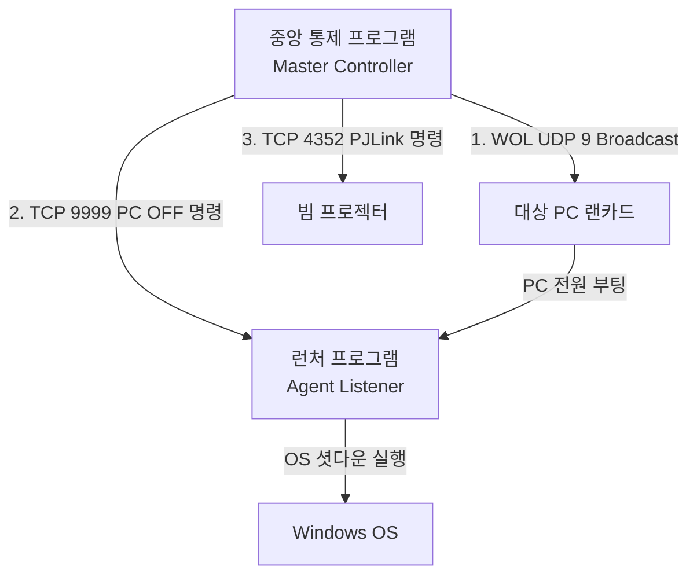

# 01. 중앙 전원 제어 프로그램 개요 및 아키텍처 (개정본)

본 문서는 시연실 내 모든 기기(PC, 프로젝터 등)의 전원을 원격으로 제어 및 모니터링하기 위한 **중앙 통제 프로그램(Showroom Power Controller)**의 전체적인 개요와 아키텍처 설계를 정의합니다. 본 개정본에서는 유연성과 직관성을 확보하기 위해 전원 제어 계층을 **전체(Global) 제어**와 **공간(Space)별 제어**의 이원화 구조로 단순화하였습니다.

---

## 1. 개발 목적
* **편의성 극대화**: 전시 준비/종료 시 매번 모든 장비를 수동으로 켜고 끄던 번거로움을 해결하기 위해, 단 한 번의 조작으로 전체 전원 통제를 지원합니다.
* **부분 및 공간 통제**: 시연실 내 특정 룸이나 전시 구역만 별도로 가동해야 하는 경우, 복잡한 단계를 거치지 않고 정의된 공간(Space) 단위로 원클릭 통제합니다.
* **장비 보호 및 모니터링**: 빔 프로젝터와 같이 종료 시 쿨링(식히기) 시간이 필수적인 장비를 시퀀스에 맞게 안전하게 종료하고, 실시간 연결 상태를 인디케이터로 노출합니다.

---

## 2. 시스템 아키텍처 (Master-Agent 구조)

본 시스템은 전체 제어 명령을 송신하는 **Master(중앙 통제 프로그램)**와 이를 수신하여 실행하는 **Agent(개인 PC의 런처 프로그램)** 및 **독립 전자기기(프로젝터 등)**로 구성됩니다.

### 2.1 제어 계층 설계 (이원화 모델)

개발 복잡성을 낮추고 직관적인 사용을 보장하기 위해 전원 관리를 딱 2가지 범위로 이원화합니다.

1. **전체 전원 제어 (Global/All Power Control)**
   * 시연실 오픈 및 마감 시 전체 기기를 한 번에 제어합니다.
   * 전체 PC로의 WOL 매직 패킷 송신 및 전체 프로젝터/에이전트로의 순차 종료 패킷 송신이 일괄 수행됩니다.
2. **공간별 전원 제어 (Space-specific Power Control)**
   * 사용자가 설정 파일에 지정한 단일 분류 기준인 **공간(Space)** 단위로 제어합니다.
   * 예: `Space` 항목이 `"로비"`인 기기들만 선별해 켜거나 끄고, `"A룸"`인 기기들만 따로 켜고 끌 수 있습니다.

---

## 3. 네트워크 통신 흐름 요약

| 제어 동작 | 대상 기기 | 사용 프로토콜 및 포트 | 데이터/명령어 형식 | 동작 설명 |
| :--- | :--- | :--- | :--- | :--- |
| **PC ON** | 콘텐츠 PC | **UDP** Port 7 or 9 | 102Byte Magic Packet | 브로드캐스트를 이용해 꺼진 PC 기상 |
| **PC OFF** | 콘텐츠 PC | **TCP** Port 9999 | `SHUTDOWN:<KEY>\r\n` | 런처 에이전트에 종료 명령 송신 |
| **Projector ON**| 프로젝터 | **TCP** Port 4352 | `%1POWR 1\r` | PJLink 표준 명령어로 프로젝터 기상 |
| **Projector OFF**| 프로젝터 | **TCP** Port 4352 | `%1POWR 0\r` | PJLink 표준 명령어로 쿨링 후 종료 |
| **상태 체크** | 공통 기기 | **ICMP** (Ping) / **TCP** | Echo Request / 상태 질의 | 기기 활성화 여부 확인 및 UI에 표시 |

---

## 4. 프로그램 중복 실행 방지 기능
관리자가 실수로 전원 제어 프로그램을 두 번 연속 켜는 것을 막아줍니다.
* 이미 프로그램이 켜져 있다면 새로 켜지지 않고, 모니터 화면 구석에 숨어있던 원래 화면을 맨 앞으로 당겨서 보여주어 바로 쓸 수 있게 해줍니다.
